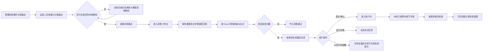
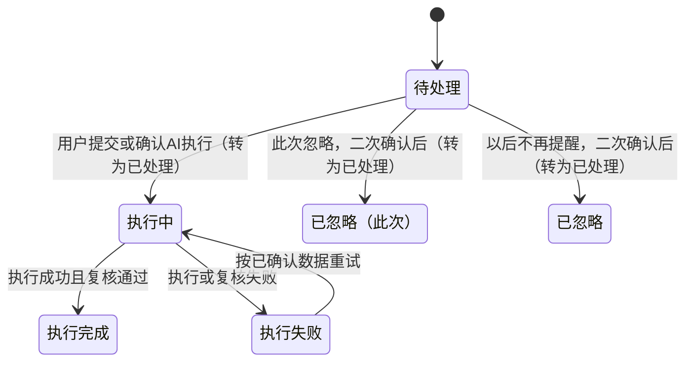

# 酒店新媒体营销平台——诊断需求 PRD

> 文档版本：v0.1  
> 整理日期：2026-08-28  
> 文档状态：待评审  
> 产品形态：PC 端  
> 适用范围：抖音来客酒店运营诊断、任务确认与 AI 执行

## 1. 文档说明

### 1.1 编写目的

本文档用于明确酒店新媒体营销平台的产品边界、用户角色、酒店与授权关系、诊断流程、任务流程、AI 执行流程及页面要求，为产品设计、交互设计、研发和测试提供统一依据。

### 1.2 需求来源与优先级

本 PRD 只整理已经确认的需求，不新增业务规则。需求依据按以下顺序管理：

1. 用户在需求讨论中明确确认的业务规则。
2. 项目业务逻辑文件 `.agents/skills/douyin-laike-business-logic/SKILL.md`。
3. 最新累计规则表 `outputs/activity_square_rule_20260827/抖音来客诊断规则表.xlsx` 中的“诊断规则”工作表；其已确认内容已完整转写至本文档第 18 章。
4. `OTA运营专家PRD_v0.2.md` 仅作为需求文档结构与表达规范的参考，不作为本产品业务需求来源。

如 PRD 与规则表出现冲突，应先向需求方确认，不得自行选择或补充口径。

本文档只记录当前有效的产品结构、页面元素、字段、状态和交互规则。需求调整过程中出现过、但不属于当前产品最终形态的名称、字段、入口和方案不写入本文档；本文档不承担变更记录或新旧方案对照用途。

### 1.3 PRD 与 Excel 规则表的关系

- 本 PRD 是产品、交互、研发和测试的完整阅读文档，包含产品流程及每个节点的诊断条件、字段映射、策略动作、任务粒度、执行方式、确认规则和数据来源。
- Excel 保留为规则维护底稿；本文档第 18 章已将全部诊断规则完整转写，阅读和评审需求时无需再打开 Excel。
- Excel 与 PRD 后续应同步维护；出现冲突时必须向需求方确认，不得自行选择口径。
- 文中标记为【待补充】的内容，表示现有讨论和 Excel 均未给出可直接开发的完整规则，不得由产品、设计、研发或 AI 自行补全。

## 2. 产品概述

### 2.1 产品名称

酒店新媒体营销平台。

### 2.2 产品定位

面向酒店代运营人员的多酒店运营工具。运营人员在管理员分配的酒店范围内，分别完成抖音来客与携程官网授权；系统以携程用户端可采集的数据为主要参考，对具体酒店的抖音来客配置进行诊断，向运营人员展示证据、差异和建议。只有运营人员确认后，AI 才可进入抖音来客执行相应操作。

### 2.3 核心原则

1. 先选酒店，再诊断或执行。
2. 酒店数据、授权、诊断、任务、忽略配置、诊断日志和校验结果按 `hotel_id` 隔离。
3. 每家酒店分别授权抖音来客与携程官网；两个授权均有效才允许诊断或执行。
4. 任务页面只展示需要写入抖音来客的字段；抖音没有的字段不展示、不诊断、不写入。
5. 携程没有可映射数据时，AI 不推测、不生成内容；按规则保持抖音当前值或交由用户确认。
6. AI 只执行用户明确确认的内容。

## 3. 用户角色与权限

### 3.1 管理员

当前已确认权限：

- 新增酒店。
- 将酒店分配给运营人员。

### 3.2 运营人员

- 登录后查看管理员已分配给自己的酒店。
- 无新增酒店权限。
- 对每家酒店分别完成抖音来客与携程官网授权。
- 选择具体酒店后发起诊断。
- 查看诊断证据、字段差异和建议。
- 按任务确认、补充、修改、提交、此次忽略或以后不再提醒。
- 查看当前酒店的 AI 执行状态和执行结果。

### 3.3 AI/系统

- 在授权有效和数据可用的前提下采集数据。
- 按 Excel 规则表逐节点诊断。
- 展示来源数据、抖音当前值、差异和待写入内容。
- 仅在用户确认后执行可自动处理的抖音来客操作。
- 执行后重新读取目标页面并校验结果。
- 对规则定义为线下处理的任务，仅展示建议和记录完成状态，不代替用户完成线下事项。

## 4. 产品范围

### 4.1 本期范围

- 酒店管理与逐酒店进入。
- 抖音来客授权。
- 携程官网授权。
- 手动诊断、每周诊断、每月诊断。
- 已获授权酒店的一键诊断；每家酒店仍独立生成诊断上下文、任务和日志。
- 诊断任务查看与确认。
- AI 自动执行与结果校验。
- 线下任务的完成记录。
- 诊断日志。
- 全部 23 个诊断节点的诊断执行。

### 4.2 产品约束

- 诊断范围、任务字段和 AI 写入范围以抖音来客当前可操作字段为边界。
- 携程无可映射数据时，按节点规则保持抖音当前值、留空或等待用户补充。
- AI 执行以用户确认作为前置条件。
- 授权、数据、任务和执行上下文按 `hotel_id` 独立保存和处理。
- 诊断节点、字段映射和策略以本文档第 18 章为准；新增规则需先完成需求确认并同步本文档。

## 5. 信息架构

### 5.1 运营端一级结构

1. 酒店管理。
2. 诊断工作台。
3. 诊断任务。
4. 诊断日志。
5. 账号管理。

酒店管理页承载逐酒店的抖音来客与携程官网授权入口。左侧导航固定提供“酒店管理”菜单和“系统管理”分组；运营人员点击“诊断”进入对应酒店的二级诊断页面（诊断工作台），全部诊断在诊断工作台内按步骤完成。进入具体酒店后，右侧内容区顶部展示二级导航：返回酒店管理入口、当前酒店名称和“诊断工作台”“诊断任务”“诊断日志”页签，酒店相关页面通过二级导航切换。

### 5.2 诊断业务菜单

诊断路径以抖音来客菜单结构和本文档第 18 章为准：

- 店铺管理。
- 商品与货架。
- 经营成长。

## 6. 核心业务流程

## 7. 酒店管理需求

### 7.1 酒店来源

- 酒店由管理员新增并分配。
- 运营人员只能查看已分配酒店。

### 7.2 分配后的默认状态

- 酒店首次分配给运营人员后，抖音来客授权默认为“未授权”。
- 酒店首次分配给运营人员后，携程官网授权默认为“未授权”。
- 未完成双授权时，不允许进入该酒店诊断或执行 AI 任务。

### 7.3 酒店列表展示

酒店管理页由全局框架、页面头部、前置条件提示、检索筛选和酒店列表五部分组成。左侧导航在各页面保持同一结构：品牌区、“酒店管理”菜单和“系统管理”分组；进入具体酒店后，酒店相关页面（诊断工作台、诊断任务、诊断日志）通过右侧内容区顶部的二级导航切换，二级导航持续展示当前酒店名称，并提供返回酒店管理页的入口。酒店管理页全部元素如下：

| 区域 | 元素 | 展示与交互要求 |
|---|---|---|
| 左侧导航 | 品牌区 | 展示平台标识、平台名称“酒店新媒体营销平台”和副标题“酒店智能运营工作台” |
| 左侧导航 | 导航菜单 | 固定展示“酒店管理”入口，右侧内容区处于酒店相关页面时该入口高亮 |
| 左侧导航 | 系统管理 | 展示“系统管理”分组与“账号管理”入口 |
| 顶部栏 | 账号区 | 位于页面右上角，展示当前账号头像、账号名称、角色和下拉入口 |
| 二级导航 | 酒店二级页签 | 进入具体酒店后，在顶部栏下方展示：返回酒店管理入口、当前酒店名称和门店副名称，以及“诊断工作台”“诊断任务”“诊断日志”页签；一个页签对应一个页面，当前页签高亮，“诊断任务”页签展示待处理任务数角标 |
| 页面头部 | 标题 | 展示“酒店管理” |
| 检索筛选 | 酒店搜索 | 支持按酒店名称检索；输入内容与筛选条件共同生效 |
| 检索筛选 | 诊断筛选 | 展示“全部酒店”“近 7 天已诊断”“近 7 天未诊断”及各自数量，当前筛选项高亮；“近 7 天已诊断”展示最近一次诊断完成时间在最近 7 天内的酒店，“近 7 天未诊断”展示最近 7 天内无诊断完成记录的酒店（含从未诊断和诊断完成时间超过 7 天的酒店） |
| 检索筛选 | 空结果 | 搜索与筛选后无匹配酒店时展示“未找到匹配的酒店，请调整搜索内容或筛选条件” |
| 酒店列表 | 酒店名称 | 展示酒店名称 |
| 酒店列表 | 抖音来客授权 | 展示该平台授权状态：已授权、未授权或已失效 |
| 酒店列表 | 携程官网授权 | 展示该平台授权状态：已授权、未授权或已失效 |
| 酒店列表 | 最近一次诊断完成时间 | 展示该酒店最近一次完整诊断的完成时间；没有完成记录时展示“暂无诊断记录” |
| 酒店列表 | 操作 | 每行固定展示授权按钮和“诊断”按钮，按钮状态按第 7.4 节处理 |
| 前置条件提示 | 授权前置说明 | 位于检索筛选和酒店列表上方醒目展示：抖音来客和携程官网都授权之后才可进行诊断 |

平台授权状态口径：

1. 授权状态分为“已授权”“未授权”“已失效”三种，按酒店和平台独立维护。
2. “已授权”指当前授权会话有效并保活中；“未授权”指该平台尚未完成授权；“已失效”指已完成过授权但会话过期，需重新授权。

“最近一次诊断完成时间”口径：

1. 数据按 `hotel_id` 独立保存，展示格式为 `YYYY-MM-DD HH:mm`。
2. 一次酒店诊断完整结束后，记录该次完成时间；诊断进行中、诊断失败或尚未形成完成记录时保持已记录时间。
3. 授权状态变化时保留已记录的最近一次诊断完成时间。
4. 最近一次诊断完成时间用于告知最近完成记录；“诊断”按钮可用性由当前双平台授权状态决定。

### 7.4 酒店操作

每家酒店固定展示两个操作按钮，状态矩阵如下：

| 当前授权状态 | 授权按钮 | 诊断按钮 | 操作结果 |
|---|---|---|---|
| 任一平台未授权 | 去授权 | 置灰、不可点击 | 点击“去授权”打开当前酒店授权弹窗，并优先定位未授权平台；弹窗提供验证码登录和账密登录两种登录方式 |
| 任一平台已失效 | 去授权 | 置灰、不可点击 | 点击“去授权”打开当前酒店授权弹窗，并优先定位已失效平台，另一平台有效状态保留 |
| 两个平台均有效授权 | 更新授权 | 高亮、可点击 | “更新授权”可选择重新授权任一平台；“诊断”进入当前酒店的二级诊断页面（诊断工作台） |

按钮状态实时取当前酒店的双平台授权结果。任一平台当前无效时，“诊断”置灰且不可点击。

## 8. 双平台授权需求

### 8.1 授权维度

- 授权关系按 `hotel_id + platform` 独立保存。
- 不同酒店之间不得复用授权。
- 抖音来客与携程官网授权互不覆盖。

### 8.2 登录方式

抖音来客和携程官网的授权弹窗均提供两种登录方式，运营人员任选其一完成授权：

- 验证码登录：输入手机号、验证码。
- 账密登录：输入账号、密码。

酒店两个平台均未授权时，点击“去授权”打开授权弹窗，按上述两种登录方式逐个平台完成授权。验证码和密码只用于当次平台登录授权，不作为业务字段展示。

### 8.3 会话保活与校验

- 授权成功后保活一段时间，具体有效时长以平台实际会话为准。
- 授权弹窗展示各平台授权状态和保活状态。
- 每次诊断前再次校验当前酒店双平台会话。
- 任一授权未完成、失效或需重新验证时，阻止诊断并引导补充对应平台授权。

## 9. 诊断需求

### 9.1 诊断前置条件

1. 已选择具体酒店。
2. 当前酒店抖音来客授权有效。
3. 当前酒店携程官网授权有效。
4. 所需页面和数据可访问。

### 9.2 诊断方式

- 手动发起单酒店诊断。
- 按每周或每月配置的周期自动诊断。
- 一键发起已获授权酒店的全部诊断；系统仍按酒店分别采集、诊断、生成任务和记录日志。

### 9.3 数据使用原则

- 以抖音来客字段为目标字段标准。
- 以携程用户端实际可见数据为采集依据；Excel 明确标注的其他来源按对应规则使用。
- 需要查看携程“服务及设施”时，必须完成页面查看后才能判断有无数据。
- 携程后台端字段仅在规则明确允许时使用；不能采集的后台字段不得作为任务数据来源。
- 抖音字段没有对应携程数据时，不诊断、不把节点从“无”改为“有”，保持抖音默认值；Excel 已确认的通用展示规则除外。
- 携程已确认存在某设施、但详情字段缺失时，仅填充可采集字段；非必填空字段保持为空。

### 9.4 诊断结果

- 符合规则：节点通过，不生成任务。
- 不符合规则且规则允许处理：展示证据与差异，生成对应粒度的建议任务。
- 数据不足：按本文档第 18 章对应节点规则处理；不得自行推测。
- 页面或授权异常：记录异常原因，不得将节点误判为通过或完成。

### 9.5 诊断工作台（二级诊断页面）

- 运营人员在酒店管理页点击“诊断”后进入当前酒店的二级诊断页面（诊断工作台），左侧导航保持不变，全部诊断在诊断工作台完成。
- 诊断按检查路径分步骤执行：以《抖音来客诊断规则表》的诊断路径为步骤（对应本文档第 12 章目录的三级路径），按路径顺序逐个诊断，当前步骤完成后自动进入下一步骤；规则表中包含的路径和规则才进入诊断。
- 页面顶部为“本次诊断进度”焦点区：突出展示诊断状态说明、进度条和检查项总数、已完成数、通过数、不通过数、已生成任务数统计，并提供“开始诊断”入口，进入页面即可直接点击开始诊断；诊断执行中该区实时更新并展示当前执行到第几步，诊断完成后提供“查看任务”“重新诊断”入口。
- 焦点区下方左侧为步骤列表：按检查路径展示全部步骤，步骤状态分为“未诊断”“诊断中”“诊断完成”三种；点击步骤，右侧“步骤备注”展示该步骤的检查项、检查规则和逐项诊断结果，诊断执行时备注跟随当前步骤。
- 检查项诊断通过时不生成任务；诊断不通过时按第 10 章生成诊断任务。
- 步骤备注面板在检查项列表下方提供“本步骤已生成任务”区，任务按行独立展示：每行展示任务名称和对应检查项，可在诊断任务列表中进入该任务的详情页处理；联合诊断节点多项不通过合并为一个任务，在该区展示为一条。
- 每个步骤完成时在步骤行展示该步骤的通过数、不通过数和生成任务数；全部步骤完成后汇总展示本次诊断的检查项总数、通过数、不通过数和生成任务总数，并提供跳转诊断任务列表的入口。
- 全部步骤完成后，更新该酒店的最近一次诊断完成时间。
- 同一酒店近 7 天内最多可发起 2 次诊断；焦点区展示剩余可诊断次数，达到 2 次后“开始诊断”“重新诊断”置灰。点击“重新诊断”直接在当前诊断结果的基础上重新开始一次完整诊断，无需回到待开始状态；重新诊断执行期间，尚未重新检查到的步骤和检查项保留展示上一次诊断的结果（标注“上次”），重新检查完成后更新为本次结果；“重新诊断”右侧固定提示“7天内只能诊断两次，请合理使用”。

## 10. 任务需求

### 10.1 任务生成

- 任务粒度由本文档第 18 章对应节点定义。
- 单字段、单设施、单房型、单商品或单评价是否合并，必须遵循对应规则，不得统一批量处理。
- 诊断任务归属当前 `hotel_id`，不得跨酒店展示或执行。

### 10.2 任务状态

任务处理状态仅针对单次诊断生成的任务，分为“待处理”“已处理”两级；“已处理”任务同时展示执行状态：执行中、执行完成、执行失败、已忽略（此次）、已忽略。

只有用户选择需要 AI 修改、填入或执行的操作，任务才进入“执行中”。

### 10.3 统一按钮

- 提交/确认：按当前节点定义进入 AI 执行或线下任务流程。
- 此次忽略：点击后弹出二次确认弹窗，确认后关闭本次任务并转为已处理，任务状态为“已忽略（此次）”；下次诊断仍检查该节点。
- 以后不再提醒：点击后弹出二次确认弹窗，确认后关闭本次任务并转为已处理，任务状态为“已忽略”；同时关闭该酒店该节点后续自动诊断提醒，直至用户主动恢复。

如节点存在“暂无此设施”、图片补充、字段编辑或多个独立确认方案，以本文档第 18 章对应节点的任务交互为准。

### 10.4 任务展示原则

- 展示当前酒店。
- 展示诊断节点和问题说明。
- 展示规则规定的数据来源和证据。
- 展示抖音当前值、携程可映射值及差异。
- 展示将要写入抖音的字段和用户可编辑内容。
- 不展示抖音来客不存在的字段。
- 任务详情与所选任务一一对应，展示该任务的诊断建议、来源数据与差异和建议写入字段；找店指引任务详情按第 18.2.5 节先选择指引方式，再按路线节点或指引视频填写；「中差评回复」任务按第 18.12.1 节逐条确认回复内容。
- 用户未确认前不得执行。

### 10.5 任务列表展示

诊断任务页按“待处理”“已处理”两个页签展示单次诊断生成的任务，页签展示任务数；二级导航“诊断任务”页签角标展示待处理任务数。

- 待处理列表字段：任务名称、任务路径、任务诊断时间、操作。操作包含“去处理”“此次忽略”“以后不再提醒”：“去处理”进入任务详情确认执行；“此次忽略”“以后不再提醒”点击后弹出二次确认弹窗，确认后任务转为已处理。
- 已处理列表字段：任务名称、任务路径、任务提交时间、任务状态（执行中、执行完成、执行失败、已忽略（此次）、已忽略）。
- 已处理页签提供任务状态筛选（全部、执行中、执行完成、执行失败、已忽略（此次）、已忽略，各选项展示对应任务数）和任务名称搜索框；筛选与搜索共同生效，无匹配任务时展示空态提示。
- 任务诊断时间、任务提交时间的展示格式为 `YYYY-MM-DD HH:mm:ss`。

## 11. AI 执行需求

### 11.1 自动执行

1. 用户确认任务。
2. 任务进入执行中。
3. AI 在执行前重新校验平台授权和目标页面当前状态。
4. AI 只写入用户确认的字段、内容、图片或选择。
5. AI 提交抖音来客。
6. AI 重新读取目标结果。
7. 结果与用户确认内容一致后标记已完成；不一致或提交失败时记录失败环节和原因。

### 11.2 线下任务

- 系统展示需要用户线下处理的内容。
- 用户完成后回到工具中点击完成。
- AI 不代替用户执行线下事项。
- 规则明确为用户补充素材、再由 AI 填写抖音来客的场景，用户提交素材后任务才可进入 AI 执行。

### 11.3 执行限制

- 禁止跨酒店执行。
- 禁止无用户确认执行。
- 禁止写入任务页未展示、用户未确认的字段。
- 禁止生成或补造规则未允许的事实、设施、价格、图片、电话、时间或其他业务数据。
- 执行前目标状态已被人工修改时，应重新校验，避免重复创建、重复报名或重复回复。

## 12. 诊断规则目录

下列目录来自最新累计 Excel 规则表。每个节点的完整诊断条件、字段映射、策略、任务粒度、确认动作、所需数据和数据来源详见本文档第 18 章。

| 序号 | 一级路径 | 二级路径 | 三级路径 | 诊断节点 |
|---:|---|---|---|---|
| 1 | 店铺管理 | 门店管理 | 基本信息 | 门店名称 |
| 2 | 店铺管理 | 门店管理 | 基本信息 | 联系电话 |
| 3 | 店铺管理 | 门店管理 | 基本信息 | 房间总数 |
| 4 | 店铺管理 | 门店管理 | 基本信息 | 营业状态 |
| 5 | 店铺管理 | 门店管理 | 基本信息 | 找店指引 |
| 6 | 店铺管理 | 酒店信息管理 | 酒店政策 | 入离政策、办理入住年龄、加床及儿童、宠物政策、早餐政策 |
| 7 | 店铺管理 | 酒店信息管理 | 酒店设施 | 酒店设施审核不通过标签 |
| 8 | 店铺管理 | 酒店信息管理 | 酒店设施 | 停车场 |
| 9 | 店铺管理 | 酒店信息管理 | 酒店设施 | 充电车位 |
| 10 | 店铺管理 | 酒店信息管理 | 酒店设施 | 餐厅 |
| 11 | 店铺管理 | 酒店信息管理 | 酒店设施 | 接机服务 |
| 12 | 店铺管理 | 酒店信息管理 | 酒店设施 | 接站服务 |
| 13 | 店铺管理 | 酒店信息管理 | 酒店设施 | 酒店设施通用规则 |
| 14 | 店铺管理 | 店铺装修 | 门店装修 | 装修审核不通过 |
| 15 | 店铺管理 | 店铺装修 | 门店装修 | 外显小图 |
| 16 | 店铺管理 | 店铺装修 | 门店装修 | 头图和相册 |
| 17 | 商品与货架 | 房型管理 | 房型管理 | 房型信息 |
| 18 | 商品与货架 | 商品管理 | 日历房 | 日历房房型与早餐份数 |
| 19 | 商品与货架 | 房价房态管理 | 房价房态管理 | 近7天房型价格 |
| 20 | 商品与货架 | 预售房型 | 预售房型 | 引流预售房型 |
| 21 | 商品与货架 | 商品管理 | 团购 | 团购商品覆盖、价格与名称 |
| 22 | 经营成长 | 商家经营分 | 评价 | 评价评分 |
| 23 | 经营成长 | 评价管理 | 评价回复 | 待回复中差评 |

## 13. 数据隔离与操作留痕

### 13.1 酒店隔离

以下数据必须包含 `hotel_id` 并按酒店隔离：

- 平台授权与会话状态。
- 采集数据。
- 诊断结果。
- 建议任务和执行任务。
- 此次忽略和以后不再提醒配置。
- 诊断日志、校验结果和错误日志。

### 13.2 操作留痕

诊断日志应能关联：

- 当前酒店。
- 诊断节点。
- 用户确认内容。
- AI 实际执行内容。
- 执行时间。
- 执行结果。
- 校验结果。
- 失败原因（如有）。

### 13.3 诊断日志展示

- 页面名称为“诊断日志”，以表格展示，每次诊断一行，按诊断时间倒序排列（最新一次在最上方）。
- 表格字段为：诊断次数、累计诊断项目数、任务数、执行成功数、执行失败数、详情。
- 诊断次数列展示“第 N 次诊断”与该次诊断时间；累计诊断项目数展示截至该次诊断累计检查的检查项总数（每次诊断的检查项数 × 诊断次数）。
- 任务数展示该次诊断生成的任务总数；执行成功数展示其中执行结果为“已完成”的任务数；执行失败数展示执行结果为“执行失败”的任务数，尚未执行的任务计入任务数、不计入成功数与失败数。
- 点击“详情”展开该次诊断的任务明细：逐条展示任务名称、检查路径、执行状态（已完成、执行失败、待处理）和执行详情说明；执行失败的任务展示失败原因及重试入口提示。

## 14. 异常与边界处理

| 场景 | 处理要求 |
|---|---|
| 未选择酒店 | 不允许发起诊断或执行 |
| 任一平台未授权 | 阻止诊断，展示需完成的平台授权 |
| 任一平台授权失效 | 阻止诊断或执行，只引导重授权失效平台 |
| 携程字段无值 | 不推测；按节点规则保持为空、保持抖音当前值或等待用户补充 |
| 抖音无对应字段 | 不诊断、不展示、不写入 |
| 页面加载或采集失败 | 记录失败原因，不把节点判为通过 |
| 执行前目标已变化 | 重新读取并按节点规则结束、刷新或继续，不重复操作 |
| 提交成功但复核不一致 | 不标记完成，记录不一致字段和失败原因 |
| 用户选择此次忽略 | 关闭本次任务，下次仍诊断 |
| 用户选择以后不再提醒 | 关闭该酒店对应节点的后续自动诊断，直至恢复 |

## 15. PC 端原型要求

### 15.1 酒店管理页

原型必须完整呈现第 7.3 节定义的全部页面元素，并满足以下要求：

- 页面名称为“酒店管理”，展示管理员分配给当前运营人员的酒店。
- 新分配酒店的抖音来客和携程官网初始状态均为未授权；示例酒店覆盖双授权有效、单平台已失效、单平台未授权和双平台未授权状态。
- 列表列名依次为“酒店名称”“抖音来客授权”“携程官网授权”“最近一次诊断完成时间”“操作”。
- 每行操作区固定展示两个按钮。任一平台无效时展示“去授权＋置灰诊断”；双平台有效时展示“更新授权＋高亮诊断”。
- “去授权”和“更新授权”均打开当前酒店的双平台授权弹窗；“诊断”进入当前酒店的二级诊断页面（诊断工作台）。
- 左侧导航固定展示品牌区、“酒店管理”菜单和“系统管理”分组，各页面保持同一结构，右上角展示账号区。
- 进入具体酒店后，右侧内容区顶部展示二级导航：返回酒店管理入口、当前酒店名称和门店副名称，以及“诊断工作台”“诊断任务”“诊断日志”页签；“诊断任务”页签展示待处理任务数角标。
- 授权入口位于对应酒店行。
- 页面支持酒店名称搜索及“全部酒店 / 近 7 天已诊断 / 近 7 天未诊断”筛选，筛选均按最近一次诊断完成时间计算。
- 前置条件提示位于检索筛选上方，醒目展示“抖音来客和携程官网都授权之后才可进行诊断”。

### 15.2 授权弹窗

- 明确当前酒店。
- 分别展示抖音来客和携程官网授权状态。
- 支持验证码登录和账密登录两种方式。
- 已授权平台显示有效/保活状态。
- 未全部授权时不得进入诊断。

### 15.3 诊断工作台（二级诊断页面）

- 从酒店管理页“诊断”或二级导航“诊断工作台”页签进入，进入后左侧导航保持不变。
- 页面首屏为“本次诊断进度”焦点区：未开始时以醒目主按钮展示“开始诊断”，进入页面即可直接点击开始；执行中以进度条和“第 N/总步数”状态实时更新；完成后展示汇总结论并提供“查看任务”“重新诊断”操作。
- 焦点区实时展示检查项总数、已完成数、通过数、不通过数和已生成任务数。
- 同一酒店近 7 天内最多可发起 2 次诊断；焦点区展示剩余可诊断次数，达到 2 次后“开始诊断”“重新诊断”置灰；“重新诊断”右侧固定备注“7天内只能诊断两次，请合理使用”。点击“重新诊断”直接在当前诊断结果的基础上重新开始一次完整诊断，无需回到待开始状态；重新诊断执行期间，尚未重新检查到的步骤和检查项保留展示上一次诊断的结果（步骤标注“上次通过/上次不通过”，检查项标注“上次通过/上次不通过”），重新检查完成后更新为本次结果。
- 焦点区下方左侧为步骤列表，按检查路径展示全部步骤，示例步骤为“基本信息、酒店政策、酒店设施、门店装修、房型管理、日历房、房价房态管理、预售房型、团购、评价、评价回复”，覆盖店铺管理、商品与货架、经营成长三条一级路径；每个步骤以“未诊断”“诊断中”“诊断完成”状态标签展示。
- 步骤按顺序逐个执行，当前步骤完成后自动进入下一步骤；执行中的步骤自动滚动到可视区域。
- 点击步骤，右侧“步骤备注”面板展示该步骤的检查项、检查规则和逐项结果；诊断执行时备注跟随当前步骤。
- 检查项结果为“通过”或“不通过”；该步骤生成的任务在步骤备注面板下方“本步骤已生成任务”区逐行展示，可在诊断任务列表中进入该任务详情。
- 步骤完成时在步骤行展示通过数、不通过数和生成任务数。
- 全部步骤完成后，该酒店的最近一次诊断完成时间同步更新。
- 诊断、任务和诊断日志只属于当前酒店。

### 15.4 诊断日志页

- 页面主体为一张日志表格，每次诊断一行，按诊断时间倒序排列，表头字段为：诊断次数、累计诊断项目数、任务数、执行成功数、执行失败数、详情。
- 诊断次数列展示“第 N 次诊断”与诊断时间；累计诊断项目数展示截至该次诊断累计检查的检查项总数；任务数、执行成功数、执行失败数为该次诊断生成任务的执行结果统计。
- 每行右侧提供“详情”按钮，点击展开该次诊断的任务明细列表，逐条展示任务名称、检查路径、执行状态（已完成、执行失败、待处理）和执行详情说明，再次点击收起。

### 15.5 账号管理页

- 入口位于左侧导航“系统管理”分组，任意时刻可达。
- 账号信息区展示账号头像、账号名称、账号角色、账号状态、登录手机号和所属组织。
- 安全设置区提供“修改登录密码”和“退出登录”入口。

## 16. 验收标准

### 16.1 酒店与权限

- 运营人员只能看到管理员分配的酒店。
- 新分配酒店两项授权均显示未授权。
- 酒店列表展示“酒店名称”“抖音来客授权”“携程官网授权”“最近一次诊断完成时间”“操作”五列。
- “抖音来客授权”和“携程官网授权”列展示对应平台的授权状态。
- 支持按“近 7 天已诊断”和“近 7 天未诊断”筛选酒店，筛选与酒店名称搜索共同生效。
- 有完成记录时按 `YYYY-MM-DD HH:mm` 展示最近一次诊断完成时间，无记录时展示“暂无诊断记录”。
- 授权变化时保留该酒店已记录的最近一次诊断完成时间；进行中或失败的诊断不更新该时间。
- 左侧导航在各页面保持同一结构：品牌区、“酒店管理”菜单和“系统管理”分组。
- 进入具体酒店后，酒店相关页面通过右侧内容区顶部的二级导航切换，二级导航展示返回酒店管理入口、当前酒店名称和四个页签，一个页签对应一个页面。

### 16.2 授权

- 每家酒店的两个授权可分别完成和保存。
- 授权状态分为“已授权”“未授权”“已失效”三种，酒店列表按平台独立展示。
- 不同酒店授权不互相影响。
- 任一授权无效时无法发起诊断或 AI 执行。
- 支持验证码登录和账密登录两种授权方式。
- 任一平台无效时，酒店行展示“去授权”，且“诊断”置灰不可点击。
- 双平台均有效时，酒店行展示“更新授权”，且“诊断”高亮可点击。
- 点击“去授权”优先定位无效平台；点击“更新授权”可选择任一平台重新授权。

### 16.3 诊断

- 诊断结果严格按照本文档第 18 章对应节点规则生成。
- 点击“诊断”进入当前酒店的二级诊断页面（诊断工作台），左侧导航保持不变。
- 进入诊断工作台即可在页面首屏“本次诊断进度”区点击“开始诊断”；诊断进度和统计在该区实时更新。
- 诊断以检查路径为步骤可视化展示，步骤状态为未诊断、诊断中、诊断完成，并按路径顺序逐个执行。
- 检查项通过时不生成任务；检查项不通过时生成诊断任务，任务在步骤备注“本步骤已生成任务”区逐行展示，在诊断任务列表中进入该任务详情。
- 每个步骤完成时展示该步骤生成任务数；全部完成后展示本次诊断生成任务总数，并可跳转诊断任务列表。
- 诊断完成后，该酒店的最近一次诊断完成时间更新。
- 同一酒店近 7 天内最多可诊断 2 次；达到上限后“开始诊断”“重新诊断”置灰；“重新诊断”右侧固定提示“7天内只能诊断两次，请合理使用”；点击“重新诊断”直接重新开始一次完整诊断，执行期间尚未重新检查的步骤和检查项展示上一次诊断结果。
- 诊断日志以表格按次展示每次诊断的累计诊断项目数、任务数、执行成功数与执行失败数，点击详情展开该次诊断的逐条任务明细。
- 任务不展示抖音不存在的字段。
- 携程无值时 AI 不自行补写。
- 任务、忽略状态、执行结果和日志按酒店隔离。

### 16.4 任务与执行

- 用户确认前 AI 不执行。
- 诊断任务页按“待处理”“已处理”两个页签展示，二级导航“诊断任务”页签角标展示待处理任务数。
- 待处理列表展示任务名称、任务路径、任务诊断时间和“去处理”“此次忽略”“以后不再提醒”三个操作。
- 点击“此次忽略”“以后不再提醒”弹出二次确认弹窗，确认后任务转为已处理；此次忽略的任务状态为“已忽略（此次）”，以后不再提醒的任务状态为“已忽略”。
- 已处理列表展示任务名称、任务路径、任务提交时间和任务状态（执行中、执行完成、执行失败、已忽略（此次）、已忽略）。
- 已处理页签支持按任务状态筛选和按任务名称搜索，两者共同生效，无匹配任务时展示空态提示。
- 任务诊断时间、任务提交时间按 `YYYY-MM-DD HH:mm:ss` 展示。
- 任务详情与所选任务一致；找店指引任务先选择指引方式（图文指引、视频指引），再按起点、途经点、终点的路线或指引视频填写后提交。
- 「中差评回复」任务逐条展示待回复评价，每条评价提供三套答复语供单选，用户可修改选中内容后提交。
- 此次忽略的任务不进入执行中，下次仍可诊断。
- 以后不再提醒按酒店和节点生效，不影响其他酒店和节点。
- AI 执行后必须复核，复核一致才标记完成。
- 诊断发现不通过项时生成对应任务；同名任务仍为待处理时不重复生成。
- 诊断完成提示与工作台分别展示不通过项数和本次生成任务数，联合诊断节点多项不通过只生成一个任务。
- 单任务粒度符合本文档第 18 章对应节点要求。

## 17. 管理员与运营端边界

管理员负责新增酒店并将酒店分配给运营人员；运营端从酒店管理页读取并管理已分配酒店。本 PRD 的页面范围从运营人员查看已分配酒店开始。

## 18. 完整诊断规则

### 18.1 本章通用说明

1. 本章所有任务均归属于当前 `hotel_id`。
2. “提交”后任务才进入执行中；AI 执行后必须重新读取目标页面并校验结果，校验成功才可完成。
3. “此次忽略”和“以后不再提醒”遵循第 10.3 节；节点存在特殊关闭范围时，以节点规则为准。
4. 携程有信息但抖音无对应字段时，不展示、不诊断、不写入。
5. 携程无值时不由 AI 推测；仅按节点规则保持抖音当前值、留空或等待用户补充。
6. 文中【待补充】不是产品默认行为，表示当前规则不足，开发前需由需求方确认。

---

### 18.2 店铺管理 / 门店管理 / 基本信息

#### 18.2.1 门店名称

**诊断规则**

1. 名称示例：`全亚酒店（重庆光环爱琴海店）`。
2. 名称公式：`酒店名称（城市＋地标简称1＋地标简称2＋店）`。
3. 当前门店名称符合公式时通过，不生成任务；不符合时进入名称优化策略。

**字段与策略**

| 目标字段 | 所需数据 | 处理规则 |
|---|---|---|
| 抖音门店名称 | 酒店名称、酒店位置 | 基于酒店方圆 3 公里热门地标获取两个地标简称，AI 按名称公式生成 1 个建议名称，预填在任务中，用户可修改 |

AI 检索提示口径为：“XX酒店方圆3公里中最热门的两个地标建筑，直接给我两个地点的简称。”AI 只生成 1 个建议名称。

**任务与执行**

- 任务：门店名称修改建议任务。任务展示当前名称与建议名称，不展示名称公式。
- 提交：建议名称已预填在输入框中，用户可直接提交，AI 写入并校验。
- 修改后提交：用户可修改建议名称，AI 按用户文本写入并校验。
- 此次忽略：关闭本次任务，下次继续诊断。
- 以后不再提醒：仅关闭当前酒店“门店名称”节点，直至恢复。
- 数据来源：携程 PC 端。

【待补充】携程 PC 端在当前产品中是否统一指已授权的携程用户端；热门地标数据的可用来源和选择口径尚未统一。

#### 18.2.2 联系电话

**诊断规则**

1. 抖音联系电话不能为空。
2. 不为空时与携程联系电话比对；一致通过，不一致生成修改建议。
3. 抖音为空时，生成携程电话填入建议。

**字段映射**

| 携程数据 | 抖音字段 | 建议值 |
|---|---|---|
| 联系电话 | 联系电话 | 携程联系电话原值 |

**任务展示**

- 任务页展示差异与修改内容：现状（抖音当前联系电话）→ 修改为（携程联系电话）。
- 修改内容与抖音来客「修改联系电话」弹窗同构：门店电话逐行展示，每行为电话类型（座机/手机）＋号码，座机行含区号与号码两个输入框；每行可删除，支持「＋ 添加电话」，最多 3 个。
- 已按携程电话预填，全部可修改；提交后 AI 按确认结果写入抖音来客并校验。

**任务与执行**

- 任务：联系电话修改/填入建议任务。
- 不一致—提交：AI 修改为携程电话并校验。
- 为空—提交：AI 填入携程电话并校验。
- 此次忽略：关闭本次任务，下次继续诊断。
- 以后不再提醒：仅关闭当前酒店“联系电话”节点。
- 所需数据：电话号码；数据来源：携程 PC 端。

【待补充】座机、手机号、总机、区号、空格和连字符等格式如何标准化后比对。

#### 18.2.3 房间总数

**诊断规则**

1. 抖音房间总数不能为空。
2. 不为空时与携程房间总数比对；一致通过，不一致生成修改建议。
3. 抖音为空时，生成携程房间总数填入建议。

**字段映射**

| 携程数据 | 抖音字段 | 建议值 |
|---|---|---|
| 房间总数 | 房间总数 | 携程房间总数 |

**任务展示**

- 任务页展示差异与修改内容：现状（抖音当前房间总数）→ 修改为（携程房间总数）。
- 修改内容与抖音来客「修改房间总数」弹窗同构：房间总数数字输入框＋单位「间」，下方提示「未填写不在抖音展示房间总数」。
- 已按携程房间总数预填，可修改；提交后 AI 写入抖音来客并校验。

**任务与执行**

- 任务：房间总数修改/填入建议任务。
- 提交：AI 修改或填入携程房间总数并校验。
- 此次忽略：关闭本次任务，下次继续诊断。
- 以后不再提醒：仅关闭当前酒店“房间总数”节点。
- 所需数据：房间总数；数据来源：携程 PC 端。

【待补充】携程用户端无法展示或无法可靠采集房间总数时的处理方式。

#### 18.2.4 营业状态

**诊断规则**

- 抖音营业状态为“正常营业”时通过；否则形成修改任务。

**任务展示**

- 任务页展示差异与修改内容：现状（抖音当前营业状态）→ 修改为（正常营业）。
- 修改内容与抖音来客「变更营业状态」弹窗同构：营业状态三选一（即将开业 / 正常营业 / 暂停营业），预填「正常营业」，可改选。
- 提交后 AI 通过「门店管理 › 更改营业状态」写入抖音来客并校验。

**策略与执行**

- 抖音目标字段：营业状态。
- 固定建议值：正常营业。
- 提交：AI 修改为正常营业并校验。
- 此次忽略：关闭本次任务，下次继续诊断。
- 不依赖额外数据源。

#### 18.2.5 找店指引

**诊断规则**

- 找店指引不为空时通过；为空时生成素材补充任务。

**任务字段**

任务详情先选择指引方式（图文指引或视频指引，任选其一，可查看优秀案例），再按所选方式填写：

| 指引方式 | 路线节点 | 用户填写/上传内容 | 约束 |
|---|---|---|---|
| 图文指引 | 起点 | 易辨认地标名称或说明、地标/全景图片、路线描述 | 描述不超过 50 字 |
| 图文指引 | 途经点 | 关键标志物名称或说明、图片、路线描述 | 可添加 0 个或多个；描述不超过 50 字 |
| 图文指引 | 终点 | 清晰完整的酒店门头图、到店说明 | 说明不超过 50 字 |
| 视频指引 | 指引视频 | 到店路线指引视频 | 时长建议控制在 90 秒以内；分辨率清晰呈现关键信息；画面保持稳定；内容禁止营销推广信息；不得出现未成年人肖像 |

AI 不生成路线、地点或图片，仅使用用户提供的内容填写抖音找店指引。

**任务与执行**

- 任务：找店指引素材补充；资料未完整前保持待补充。
- 提交：资料完整后进入执行中，AI 填写并提交，校验成功后完成。
- 此次忽略：本次关闭，下次继续诊断。
- 以后不再提醒：仅关闭当前酒店“找店指引”节点。
- 数据来源：用户线下确认和提供。

【待补充】起点和终点各项中哪些为强制必填；图片数量、格式、尺寸和大小限制尚未定义。

---

### 18.3 店铺管理 / 酒店信息管理 / 酒店政策

#### 18.3.1 酒店政策联合任务

联合范围包括：入离政策、办理入住年龄、加床及儿童、宠物政策、早餐政策。五个分组均配置时通过；存在未配置项时形成一条联合补充任务，五组全部完成后才可提交。

##### A. 入离政策

| 携程数据 | 任务页展示 | 抖音底层字段映射 |
|---|---|---|
| `10:30后入住` | 入住时间：10:30 后，可编辑 | 最早入住=其他时间 10:30；最晚入住=不限 |
| `13:00前退房` | 退房时间：13:00 前，可编辑 | 最早离店=不限；最晚离店=其他时间 13:00 |
| 无对应数据 | 入住方式下拉框 | 由用户选择入住方式 |

任务页只展示入住时间、退房时间和入住方式，不向用户暴露四个底层时间控件。

##### B. 办理入住年龄

| 携程数据 | 抖音字段 | 映射规则 |
|---|---|---|
| 接待提示中的最小年龄限制，如年满 18 岁 | 最小年龄 | 对应限制年龄，示例为 18 |
| 未展示最大年龄限制 | 最大年龄 | 不限制 |

##### C. 加床及儿童

| 携程政策 | 抖音字段及建议值 |
|---|---|
| 17 岁及以下儿童使用现有床铺、免费 | 可携带 18 岁以下儿童=是；允许年龄=年龄不限；允许人数=1；收费标准=0—17 岁免费 |
| 不可携带儿童 | 可携带儿童=否；隐藏且不填写后续儿童字段 |
| 所有房型不可加床、不提供婴儿床 | 加床=不提供；婴儿床=不提供 |
| 所有房型可免费加床、提供婴儿床 | 加床=免费提供；婴儿床=提供 |
| 所有房型可收费加床、不提供婴儿床 | 加床=额外收费提供；成人及儿童加床费用按携程收费规则；婴儿床=不提供 |

##### D. 宠物政策

| 携程政策 | 抖音字段及建议值 |
|---|---|
| 允许携带＋免费 | 允许宠物=是；宠物免费=是 |
| 允许携带＋收费 | 允许宠物=是；宠物免费=否 |
| 不允许携带 | 允许宠物=否 |

##### E. 早餐政策

| 携程政策 | 抖音字段及建议值 |
|---|---|
| 展示早餐形式和菜品 | 提供早餐=提供；早餐形式、类型、种类/菜品、早餐时间按携程同步 |
| 明确不提供早餐 | 提供早餐=不提供 |

**任务与执行**

- 任务页先逐项展示对比行——现状（抖音来客当前配置）→ 携程（携程 PC 端采集值）→ 修改为（AI 按映射规则预填，可修改），并标注「有差异 · 需修改」或「一致 · 核对通过」；随后展示与抖音来客「酒店政策」页面字段同构的五组可编辑表单。
- 携程未采集到的政策字段，AI 不推测、保持当前值或留空，由用户选择完成后再提交（如儿童早餐的年龄 / 身高为提交前必选）。
- 任一分组必填项不完整时禁止提交。
- 提交：AI 统一填写并提交酒店政策，全部分组校验成功后完成。
- 此次忽略、以后不再提醒均作用于整个联合节点，不拆分到单一政策。
- 数据来源：携程 PC 端；入住方式由用户选择。

【待补充】早餐“每日开放/指定时间”的判断条件；餐食形式、类型、菜品与抖音选项的完整字典；“携程 PC 端”是否统一为携程用户端。

---

### 18.4 店铺管理 / 酒店信息管理 / 酒店设施

#### 18.4.1 设施通用规则

**诊断顺序**

1. 先查看携程用户端“服务及设施”是否存在该设施及可映射详情。
2. 再读取抖音该设施当前有/无状态、可填写字段、选项、必填项和联动条件。
3. 携程存在设施：按已确认映射比对和预填。
4. 携程未采集到的设施不做检测和诊断，直接跳过；不创建确认任务、不在任务中展示。

**任务展示与执行**

- 已有问题设施合并为一条「酒店设施信息核对任务」，全部数据一并确认、一并写入；不存在仅处理单个设施的独立任务。
- 以抖音来客为主：仅检测和诊断抖音来客存在的数据；携程采集值在抖音来客无对应字段或选项时，该部分不做检测和诊断。
- 携程同一设施不存在多条并列数据，无取数歧义场景。
- 以抖音字段为边界，展示携程数据、抖音当前值、建议值和可编辑控件。
- 用户保持“无”：点击“暂无此设施”，该设施保持或改为“无”，不写入。
- 用户改为“有”：若抖音存在额外/必填字段则展开；仅写入用户确认内容。
- 携程有数据：用户确认后提交，AI 将全部确认数据一并写入并校验。
- 仅有有/无开关的设施，切换为有后不展示额外字段。
- 写入成功后如需改回“无”，不生成新任务。
- 执行以诊断时传递的采集值为准，执行时不再重新采集携程数据。

【待补充】除停车场、充电车位、餐厅、接机、接站外，全部抖音设施与携程设施的标准名映射字典、字段字典、必填条件和图片规则尚未逐项定义。

#### 18.4.2 酒店设施审核不通过

**诊断规则**

- 查看抖音来客酒店设施顶部是否存在“审核不通过”标签；不存在则通过、不生成任务。
- 存在时读取全部被驳回设施及各设施的审核不通过原因，生成独立的「酒店设施审核整改任务」。

**任务粒度**

- 某一项设施图片审核不通过，仅替换该设施的图片；该设施其他已通过图片与已配置字段保持不变。
- 多个设施图片审核不通过时，合并为同一条整改任务，逐设施独立确认、独立执行。
- 本任务独立于酒店设施详情补充任务。

**任务展示（逐被驳回设施）**

- 设施名称、抖音来客路径（酒店设施 › 设施名）与“图片审核未通过”状态。
- 审核不通过原因。
- 当前被驳回图片（含上传时间与来源）。
- 替换图片：携程“服务及设施”已有该设施图片时预填供确认、可更换；携程未采集到时必须由用户上传后才可提交。
- 上传要求：上传设施图片需平台审核通过后才可生效；请选择与该设施相关的图片以便于审核通过；建议分辨率 750×562 或比例 4:3，大小不超过 5MB。
- 处理范围：仅替换该设施审核不通过的图片。
- 处理意向（逐设施选择）：提交审核 / 暂无此设施。

**执行动作**

- 提交审核：任务进入执行中，AI 使用替换图片在抖音来客重新提交设施审核，提交成功并完成结果校验后标记已完成。
- 暂无此设施：任务进入执行中，AI 将该设施由“有”改为“无”，写入成功并完成结果校验后标记已完成。
- 此次忽略：本次关闭，下次仍检查审核不通过标签。
- 以后不再提醒：关闭该酒店“设施审核不通过”标签的后续诊断与提示，不影响酒店设施的常规补充诊断。

#### 18.4.3 停车场

**触发和校验**

- 携程采到停车场且抖音为无：建议改为有。
- 抖音已为有：只校验双方可对应且已填写的字段；一致通过，不一致展示双方值；抖音空而携程有值则预填。
- 在携程已确认存在停车场前提下，双方均无值的非必填详情保持为空。

**字段映射**

| 携程字段/值 | 抖音字段 | 建议值 |
|---|---|---|
| 采集到停车场 | 停车场 | 有 |
| 所处位置=酒店内停车场 | 位置 | 酒店内 |
| 所处位置=酒店附近 | 位置 | 酒店附近 |
| 公共停车场 | 类型 | 公共停车场 |
| 私人停车场 | 类型 | 私人停车场 |
| 预约信息=不需要提前预约 | 预定方式 | 无需预定 |
| 预约信息=需要预约 | 预定方式 | 需要预定 |
| 免费标签 | 收费信息 | 免费 |
| 收费标签 | 收费信息 | 收费 |

**任务与执行**

- 停车场纳入「酒店设施信息核对任务」，与全部问题设施一并确认、一并写入。
- 提交：AI 设置为有并写入用户确认字段。
- 暂无此设施：AI 保持或修改为无。
- 数据来源：携程服务及设施中的停车场数据。

【待补充】收费停车场是否存在价格字段、价格单位和映射规则；预约说明的其他文本是否需要映射。

#### 18.4.4 充电车位

**触发和校验**与停车场相同；仅在携程确认存在充电车位后建议从无改为有。

**字段映射**

| 携程字段/值 | 抖音字段 | 建议值 |
|---|---|---|
| 采集到充电车位 | 充电车位 | 有 |
| 酒店内 | 具体位置 | 酒店内 |
| 酒店附近 | 具体位置 | 酒店附近 |
| 快充 | 充电方式 | 勾选快充 |
| 慢充 | 充电方式 | 勾选慢充 |
| 快充和慢充 | 充电方式 | 两项均勾选 |
| 一般充电桩 | 充电桩类型 | 一般充电桩 |
| 特斯拉目的地充电桩 | 充电桩类型 | 特斯拉目的地充电桩 |
| 特斯拉超级充电桩 | 充电桩类型 | 特斯拉超级充电桩 |
| 充电车位数字 | 充电车位数量 | 对应数字；未采集则留空 |
| 免费标签 | 收费信息 | 免费充电 |
| 收费标签 | 收费信息 | 收费充电 |

充电方式和充电桩类型可多选。提交后 AI 设置为有并写入已确认字段；“暂无此设施”则保持或改为无。

【待补充】小鹏、理想等其他充电桩类型的完整映射；收费充电是否存在价格字段及规则。

#### 18.4.5 餐厅

**触发和必填**

- 携程服务及设施存在早餐厅时，抖音餐厅由无建议改为有。
- 抖音已为有时按双方可用字段校验。
- 图片为提交必填项，无图片不可提交。

**抖音字段映射**

| 携程数据 | 抖音字段 | 映射规则/示例 | 必填性 |
|---|---|---|---|
| 早餐厅存在 | 餐厅 | 有 | 是 |
| 餐厅名称 | 餐厅名称 | 有值时同值；无值不推测 | 否 |
| 形式=自助/单点 | 菜单类型 | 自助→自助；单点→单点 | 是 |
| 餐食选择=仅限入住客人用餐 | 其他服务/要求 | 仅限入住客人用餐 | 是 |
| 餐厅菜系 | 菜系 | 映射对应选项 | 否 |
| 早餐厅或类型描述中的供应信息 | 供应 | 早餐 | 是 |
| 特殊饮食 | 支持特殊饮食 | 有值时映射；无值不推测 | 否 |
| 类型描述中的风格，如现代 | 氛围/风格 | 现代 | 否 |
| 周一至周日 08:00—10:00 | 开放时间 | 每日开放 08:00—10:00 | 是 |
| 不同日期时段不同 | 开放时间 | 指定时间 | 是 |
| 服务及设施中的早餐厅图片 | 上传图片 | 预填，可保留/替换 | 是 |

**任务与执行**

- 餐厅纳入「酒店设施信息核对任务」，与全部问题设施一并确认、一并写入。
- 携程有图时预填；无图时必须由用户上传。
- 提交：AI 设置餐厅为有，写入字段和图片并校验。
- 暂无此设施：AI 保持或改为无。

【规则冲突待确认】Excel 写明餐厅结构化字段来自携程后台、图片来自携程用户端；产品全局又要求依据携程用户端可见信息。需确认餐厅名称、菜单类型、菜系、供应、特殊饮食、风格和开放时间最终允许采集的页面。

【待补充】菜系、供应、特殊饮食、氛围/风格的完整选项映射；图片数量、尺寸、格式和大小限制。

#### 18.4.6 接机服务

**数据边界**

- 唯一采集来源为携程用户端“服务及设施”；携程后台只用于理解，不采集、不映射。
- 用户端明确出现专车接机、班车接机或其他接机服务才判定存在；仅有送机不触发。

**字段映射**

| 携程用户端数据 | 抖音字段 | 建议值 |
|---|---|---|
| 明确存在接机 | 接机服务 | 有 |
| 专车接机 | 接送方式 | 专车 |
| 班车接机 | 接送方式 | 拼车 |
| 无可识别类型 | 接送方式 | 留空，由用户选择 |
| 免费标签 | 收费信息 | 免费 |
| 仅显示收费、无金额 | 收费信息/价格 | 收费；价格留空 |
| 收费信息为每车 100 元 | 收费信息/价格 | 收费；价格=100 |
| 需要提前预约 | 是否需要预约 | 是 |
| 无需预约 | 是否需要预约 | 否 |
| 周一至周日 00:00—23:59 | 开放时间 | 每日开放 00:00—23:59 |
| 不同日期时段不同 | 开放时间 | 指定时间 |
| 车型品牌，如别克 | 车型品牌 | 别克 |
| 服务频次未展示 | 服务频次 | 留空，不从后台补充 |

不得从服务名称旁的价格文案推断价格，只能从收费信息读取。

**任务与执行**

- 任务页只展示收费信息及价格、是否预约、开放时间、接送方式、车型品牌、服务频次。
- 提交：设置为有并写入用户确认字段。
- 暂无此设施：保持或改为无。

【待补充】车型品牌完整选项映射；预约说明是否仅展示还是需要写入某个抖音字段。

#### 18.4.7 接站服务

**数据边界**与接机一致：只采集携程用户端明确展示且可映射到抖音来客的接站服务数据。

**字段映射**

| 携程用户端数据 | 抖音字段 | 建议值 |
|---|---|---|
| 明确存在接站服务 | 接站服务 | 有 |
| 专车接站/送站 | 接送方式 | 专车 |
| 班车接站/送站 | 接送方式 | 拼车 |
| 免费标签 | 收费信息 | 免费 |
| 仅显示收费、无金额 | 收费信息/价格 | 收费；价格留空 |
| 收费信息为每车 100 元 | 收费信息/价格 | 收费；价格=100 |
| 需要提前预约/无需预约 | 是否需要预约 | 是/否 |
| 周一至周日 08:30—22:30 | 开放时间 | 每日开放 08:30—22:30 |
| 不同日期时段不同 | 开放时间 | 指定时间 |
| 车型品牌 | 车型品牌 | 同值映射 |
| 每 3 小时 3 次 | 服务频次 | 每 3 小时 3 次 |

任务只展示抖音可写入字段；提交后 AI 设置为有并写入；“暂无此设施”则保持或改为无。

【待补充】车型品牌完整选项映射；服务频次的允许范围和输入校验。

---

### 18.5 店铺管理 / 店铺装修 / 门店装修

#### 18.5.1 图片素材池

诊断前采集携程酒店页面头部全部图片，并保留原始链接、携程标识/类别、排序和所属类别；按酒店隔离保存，不得跨酒店复用。

#### 18.5.2 装修审核不通过

**诊断规则**：读取抖音审核标识；无驳回通过。有驳回时 AI 无需分析失败原因，直接进入「头图和相册」读取哪些图片审核不通过；全部被驳回图片合并为一条整改任务。

**任务展示**：审核失败提交时间、商家相册分类张数概览（与抖音来客「头图和相册」详情一致）、逐张被驳回图片（类别、名称与“审核不通过”标识）。

**执行动作**

- 逐张重新上传替换：为每张被驳回图片选择“重新上传替换”并上传新图；建议比例 4:3，PNG / JPG / JPEG / GIF，不超过 20M，禁止水印、边框、二维码、图片拼接及大量文字。
- 删除图片：为该图选择“删除”；删除造成空缺（门店头图为空或相册类别无图）时，自动生成「头图相册补充任务」。
- 提交：AI 将替换 / 删除结果写入抖音来客并重新提交审核；提交成功即本轮诊断成功并结束，再次被驳回不重新生成任务。
- 此次忽略：下次仍诊断。
- 以后不再提醒：只关闭当前酒店装修审核问题。

#### 18.5.3 外显小图

**诊断规则**

- AI 点击「去设置」，读取抖音当前外显小图（单列外显小图）。
- 与携程图片素材池「外观」类别图片逐一做一致性比对；查到相同图片则通过，未查到则形成一条「外显小图替换建议任务」。

**外显小图规范（与抖音来客一致）**

- 单列外显小图：展示在店铺列表、地点列表等页面，作为门店头像；比例 1:1，支持 PNG / JPG / JPEG / GIF / WEBP 格式，不超过 20M；建议上传最能代表门店的图片，如品牌 logo、环境、招牌商品等。
- 双列外显小图：展示在搜索列表，支持上传多张候选图片，平台按图片质量筛选优质图展示；比例 4:3，支持 PNG / JPG / JPEG / GIF / WEBP 格式，不超过 20M。

**任务详情核对**

- 任务详情展示替换前后的对比：替换前为抖音当前外显小图（标注其展示位置），替换后默认选中携程「外观」类别首图，并展示修改内容（由什么图替换为什么图）。
- 替换后图片可点选携程「外观」类别其他图片更换，或本地上传；确认后 AI 替换抖音来客外显小图并重新读取校验，校验成功后标记已完成。
- 详情同时展示双列外显小图的当前候选图与上传规范。
- 详情列出本规则待确认口径（一致性判定方式、比对覆盖的小图位置、双列候选图是否补充、携程外观图缺失时的处理、替换后的审核跟踪），确认前 AI 仅按已确认部分执行。
- 支持此次忽略和以后不再提醒；「以后不再提醒」只作用于当前酒店外显小图，直至用户恢复。

【待补充】一致性比对的判定方式（原图链接 / 文件哈希 / 感知相似度 / 人工确认）；双列候选图是否纳入比对与补充。

#### 18.5.4 头图和相册

- 路径：店铺装修 / 门店装修 / 头图和相册。
- 同时检查门店头图和商家相册；两处均有图时通过，任一缺图时形成一条任务。

| 缺图位置 | 携程图片来源 | 抖音写入位置 |
|---|---|---|
| 门店头图 | 精选图类别 | 门店头图 |
| 商家相册 | 按携程图片类别归类 | 对应抖音商家相册类别 |

**门店头图规范（与抖音来客一致）**

- 头图形式为视频或图片单选，默认图片；切换形式后按对应规范上传。
- 视频形式：比例 16:9，时长 15~60 秒，大小不超过 200M，最多 1 个。
- 图片形式：比例 4:3，格式 PNG / JPG / JPEG / GIF，大小不超过 20M，最多 1 张。
- 禁止上传含水印、边框、二维码、图片拼接及大量文字的图片。
- 门店头图默认展示在门店首页和相册二级页，可拖动变更顺序。

**商家相册规范（与抖音来客一致）**

- 相册类别：全部、外观、公共区域、房间、餐厅、休闲、商务、儿童玩乐、周边、其他。
- 从「全部」上传的图片通过审核后，平台自动分类；按类别上传的图片直接进入对应类别。
- 图片带状态标签：分类标签、优质图片、审核不通过、待补充信息；审核不通过的图片不计入有效图片。

**任务详情核对**

- 任务详情集中展示全部缺图位置及当前状态（门店头图未设置、各类别当前张数、审核不通过张数），并展示逐位置的补充方案。
- 门店头图补充方案按抖音来客「门店头图」表单呈现：头图形式（视频 / 图片）单选，默认图片；系统默认展示携程「精选图」中的外观任一图片（标注所选来源与图片名），供用户确认，可更换。
- 商家相册按缺图类别逐卡片展示：相册类别、当前张数、建议上传张数（固定，无需修改）、已选图片（采集自携程对应类别并上传，可更换）；需修改的是所选图片。
- 图片与头图形式均可修改；提交后 AI 仅将用户确认的图片写入抖音来客，写入后重新读取并校验。
- 支持此次忽略、以后不再提醒；「以后不再提醒」只关闭当前酒店的头图和相册节点。

---

### 18.6 商品与货架 / 房型管理

#### 18.6.1 房型信息

**数据范围**

- 携程：房型名称、楼层、面积、床型、窗户、可住人数、房型图片、网络服务、房间设施。
- 抖音：房型名称、房型描述、房型设施及房型列表。

**房型匹配与数量规则**

1. 以房型主体名称一致判定同一房型：携程采集「亲子家庭房」、抖音对应「亲子家庭房-赠送小孩早餐·免费携带宠物」时，主体名称一致即判定为同一房型，自动对应、诊断通过，并继续比对该房型床型、面积等字段是否需与携程一致。
2. 抖音多出的房型无需诊断，默认通过；按规则不删除、不形成任务。
3. 不能只比较房型数量，须逐房型完成字段校验。
4. 抖音房型少于携程时，先校验已有对应房型，再为缺失房型生成新增任务。

**已确认口径**

- 已关联日历房、团购商品的抖音房型允许改名；改名后商品相应修改，关联不受影响。
- 楼层、面积默认按区间写入，不取中间值。
- 网络服务映射：携程为「WiFi 免费」时，抖音勾选「可上网＋WiFi 免费」。
- 房型图片存在差异时仅补缺，头图保持不变。
- 抖音有而携程未采集的字段，提示用户补充；抖音来客非必填的字段，用户也可无需补充。

**字段映射**

| 携程字段 | 抖音字段组 | 规则 |
|---|---|---|
| 房型名称 | 房型名称 | 同值比对/写入 |
| 房型图片 | 房型描述 | 对应图片项 |
| 楼层 | 房型描述 | 对应楼层项 |
| 面积 | 房型描述 | 对应面积项 |
| 床型 | 房型描述 | 对应床型项 |
| 窗户 | 房型描述 | 对应窗户项 |
| 可住人数 | 房型描述 | 对应可住人数项 |
| 网络服务 | 房型描述 | 对应网络服务项 |
| 房间设施（房间详情） | 房型设施 | 仅映射有明确对应关系的设施 |

**任务粒度**

- 一个房型一条任务。
- 同一房型 N 个差异字段合并在同一任务；不同房型不得合并。
- 已有房型差异任务：展示对应关系与数量口径，以及每个差异字段的抖音当前值、携程值和修改内容；修改内容控件与抖音来客表单同构（楼层、面积按区间输入；床型按「1张床/2张床/多张床」结构编辑；网络服务按勾选；设施按勾选），全部可修改。一致字段不展示。
- 缺失房型新增任务：仅展示需填入的字段，不展示各字段枚举值；已按携程预填、全部可修改。楼层、面积以「区间 xx 至 xx」展示，区间端点可修改、不可改为固定值；房型设施仅展示需勾选写入项，可增删；用户必须填写该房型总房间数；AI 选择抖音“手动创建”。

**执行和关闭范围**

- 已有房型提交：只修改该任务内用户确认字段。
- 已有房型以后不再提醒：关闭当前酒店当前房型全部差异提示，不影响其他房型。
- 缺失房型提交：只新增当前房型。
- 缺失房型仅支持此次忽略，不提供以后不再提醒。
- 对应关系提交只保存匹配关系并继续诊断，不进入执行中。

【待补充】房型设施完整映射字典；房型图片数量和规格。

---

### 18.7 商品与货架 / 商品管理 / 日历房

#### 18.7.1 日历房房型与早餐份数

**诊断规则**

1. 比较房型管理房型集合与日历房上架房型集合，不只比较数量。
2. 日历房房型只能小于或等于房型管理房型，不存在大于场景。
3. 房型管理存在但日历房未上架：每个缺失房型一条新增日历房任务。
4. 集合一致后，逐房型比较早餐份数；携程早餐展示“无早 / 1份早餐 / 2份早餐”按 0 / 1 / 2 份映射，具体以携程实际采集数据返回为准。
5. 已上架日历房价格不在本节点诊断。

**新增日历房字段**

| 字段 | 建议值与来源 |
|---|---|
| 房型 | 选择当前缺失的抖音房型管理房型 |
| 早餐份数 | 携程当前早餐份数；无早餐填 0 |
| 房价 | 诊断执行时采集的携程当前实时房价 |

**早餐修改字段**

- 任务内仅展示本任务不通过的房型；已通过房型不在任务内展示、不生成任务。
- 展示当前房型名称、日历房名称及 ID、抖音当前份数、携程当前份数，以及修改内容「早餐份数 X 份 → Y 份」。
- 修改内容默认按携程份数预填，允许用户灵活修改；只能填入正整数，抖音来客早餐份数最小值允许 0 份。
- 修改早餐份数后，日历房名称由抖音来客自动更新；AI 写入后同步校验日历房名称是否已按新份数更新。
- 修改早餐份数不要求重新维护价量态（近 3 个月内 30 天房价 / 房量）；对已生成未入住订单不影响，仅对修改后新增的订单有影响。
- 提交后 AI 仅按用户确认后的份数修改该房型早餐份数，写入及校验成功后完成。

**任务粒度和关闭范围**

- 一个缺失房型一条新增任务；一个早餐不一致房型一条修改任务。
- 不同房型分别确认、提交、执行和校验。
- 以后不再提醒只关闭当前房型在当前问题分支，不影响其他房型和房价诊断。

【待补充】携程同一物理房型存在多个售卖方案时，早餐份数和实时房价取哪一个方案。

---

### 18.8 商品与货架 / 房价房态管理

#### 18.8.1 近 7 天房型价格

**时间口径**：包含诊断当天在内，向后连续 7 个自然日。

**诊断规则**

1. 使用已确认的携程—抖音房型对应关系。
2. 按“同一房型＋同一日期”比较逐日实时价格。
3. 抖音价格≤携程价格：该日期通过，不修改。
4. 抖音价格＞携程价格：异常，建议改为对应日期携程实时价格。
5. 同一房型所有异常日期合并为一条任务；不同房型分别生成任务。
6. 本节点不诊断房态、库存或早餐。

**任务字段**

| 展示项 | 内容 |
|---|---|
| 房型 | 房型名称及双方对应关系 |
| 逐日对比 | 日期、携程实时价格、抖音当前价格、诊断结果、建议价格 |
| 通过日期 | 标记通过；建议“不修改” |
| 异常日期 | 标记价格偏高；建议价格以输入框展示，默认预填携程该日实时价格，用户可修改后提交 |
| 汇总 | 当前房型异常日期数量 |

提交后 AI 只修改异常日期；部分失败时记录成功日期、失败日期和原因，不得完成。以后不再提醒只关闭当前酒店当前房型的近 7 天价格诊断。

【待补充】价格是否包含税费、服务费、会员折扣或优惠券；携程同房型多个价格方案的对比口径。

---

### 18.9 商品与货架 / 预售房型

#### 18.9.1 引流预售房型

**引流房型筛选**

1. 采集诊断当次携程全部在售房型及实时价格。
2. 按价格从低到高取前两个价格档位；每个档位内全部同价房型均纳入，最终可超过两个房型。
3. 使用已确认的房型对应关系定位抖音适用房型。

**存在性与唯一性**

- 已存在对应适用房型的预售房型时直接通过，不校验其名称、售卖时段或房量。
- 不存在时一个引流房型形成一条新增任务。
- 同一适用房型只允许一个预售房型。

**新增字段**

| 抖音字段 | 建议值 | 数据来源 |
|---|---|---|
| 商品售卖时段 | 全日房 | 固定值 |
| 适用房型 | 携程引流房型对应的抖音房型 | 房型对应关系 |
| 预售房型名称 | 所选抖音适用房型名称 | 抖音来客 |
| 房量房态—基础房量 | 限制数量 | 固定值 |
| 房间数量 | 诊断当次抖音房价房态管理中的该房型房量 | 抖音来客 |

携程价格仅用于筛选和向用户说明，不写入预售房型字段。

**任务详情核对**

- 任务详情集中展示最低两个价格档位及档位内房型实时价格，标明本次补充的引流房型；提示：“检测到价格最低的XX房型没有在预售房型中，是否根据携程完善预售房型？详情信息如下。”
- 新增方案以抖音来客「创建预售房型」表单呈现，全部内容可修改：
  - 商品售卖时段：全日房 / 钟点房单选，默认全日房。
  - 预售房型名称：预填适用房型名称，与适用房型名称保持一致（必填，40 字以内，可修改）。
  - 适用房型：预填当前引流房型对应的抖音物理房型（名称、ID、面积 / 可住人数），可移除后重新选择。
  - 时段：预填售卖时段区间，可添加多个时段。
  - 适用星期：周一至周日默认全选，显示实际选中天数。
  - 房量房态：基础房量默认「限制数量」并预填该房型当前房量（可修改）；房态默认「有房」。
- 表单提示发布要求：需至少维护近 3 个月内 30 天的房价 / 房量，且房态设置为「有房」后才可发布。

**任务文案和执行**

- 提示：“检测到价格最低的XX房型没有在预售房型中，是否根据携程完善预售房型？详情信息如下。”
- 展示房型名称、售卖时段、适用房型、预售房型名称、基础房量和房间数量。
- 提交前再次检查是否已被人工创建；已存在则不重复创建。
- 以后不再提醒只关闭当前酒店当前房型的预售房型补充任务。

【待补充】“诊断当次房量”对应哪一天或哪个库存口径；房量为 0 或无法读取时是否允许创建。

---

### 18.10 商品与货架 / 商品管理 / 团购

#### 18.10.1 团购商品覆盖

1. AI 逐个点击团购商品“查看”，读取商品搭配、价格、名称、间夜数、不可入住日期、预约及入住规则。
2. 未来 30 天无节假日：每个预售房型至少有一个日常团购。
3. 未来 30 天有节假日：仅取最近一个节假日；每个预售房型分别检查日常团购和节假日团购。
4. 两种都缺少：日常与节假日两个新增方案在核对任务内独立展示、可分别确认；只缺一种则只展示缺失方案。
5. 一个团购商品只能搭配一个预售房型；同一预售房型可分别有日常和节假日团购，二者名称、价格必须不同。

#### 18.10.2 新增团购字段

| 字段 | 日常团购 | 节假日团购 | 来源/说明 |
|---|---|---|---|
| 商品品类 | 门店品类，层级分隔为 `/` | 同左 | 抖音门店管理 |
| 商品类型 | 预售券 | 预售券 | 固定值 |
| 商品售卖时段 | 全日房 | 全日房 | 固定值 |
| 商品名称 | 房型＋间夜数＋免费特色＋酒店名中的景区名 | 【最近节假日】＋房型＋间夜数＋免费特色＋酒店名中的景区名 | 无真实数据的组成项跳过 |
| 商品搭配—住宿 | 当前预售房型 | 当前预售房型 | 抖音预售房型 |
| 商品搭配—餐食 | 关联物理房型有免费早餐时，按餐食类型（早餐 / 其它）添加并填写份数 | 同左 | 携程用户端 |
| 商品搭配—礼遇 | 通过「添加项目」自行新增：项目名称、份数，选填划线价与图片说明 | 同左 | 用户 |
| 包含数量 | 基础方案 1 夜 | 基础方案 1 夜 | 按实际方案间夜数 |
| 划线价 | 携程对应物理房型划线价 | 同左 | 携程用户端 |
| 售价 | 日常每晚价×间夜数×95% | 最近节假日期间最低每晚价×间夜数×95% | 携程用户端 |
| 套餐图 | 对应物理房型图片；携程无图片时由用户上传 | 同左 | 携程用户端 / 用户 |
| 不可入住日期 | 选择节假日不可用，覆盖全年全部节假日区间 | 不选择节假日不可用 | 抖音页面选项 |
| 预约规则 | 需要提前预约；提前 1 天 | 同左 | 固定规则 |
| 取消预约规则 | 沿用抖音默认 | 同左 | 不主动修改 |
| 最早入住时间 | 携程入住时间 | 同左 | 携程用户端 |
| 最晚退房时间 | 携程退房时间 | 同左 | 携程用户端 |

#### 18.10.3 价格诊断

- 实际售价优先取商促价；无商促价取非划线价；划线价不参与实际售价比较。
- `P`=适用每晚价格，`N`=间夜数，`S`=抖音实际售价，`C=P×N`。
- 日常 `P`=携程日常价；节假日 `P`=最近节假日期间最低每晚价。
- `S≤C` 通过；`S>C` 形成一条价格核对项；建议售价=`P×N×95%`。

#### 18.10.4 名称诊断

- 日常和节假日商品分别按动态名称公式检查。
- 不存在的数据项直接跳过，AI 不生成事实。
- 不同商品名称不得完全相同。

#### 18.10.5 任务生成与详情核对

- 「团购商品覆盖、价格与名称」不通过时生成一条「团购商品核对任务」，任务详情集中展示本次全部不通过项，按三类分组：
  - 需新增的团购商品：按预售房型分组；一个房型的日常与节假日商品均缺失时，同一分组内展示两个完整新增方案，字段按 19.10.2 预填。
  - 价格需修改的商品：每个商品一条核对项，展示商品、关联预售房型、间夜数、携程基准价、对比总价与当前售价。
  - 名称需修改的商品：每个商品一条核对项，展示当前名称与建议名称。
- 详情内容以抖音来客商品表单呈现：选择项展示为选择项、输入项展示为输入框，全部内容可修改，提交后 AI 按用户确认并修改后的内容写入。
- 商品搭配分为住宿、餐食、礼遇三部分：住宿从已配置的预售房型中选择，一个商品仅搭配一个预售房型；餐食按餐食类型（早餐 / 其它）与份数填写；礼遇通过「＋ 添加项目」由用户自行新增，填写项目名称（12 字以内）、数量（份）、选填划线价与图片说明，不得填写餐食与房型信息。
- 套餐图展示预填图片，点击「上传替换」后直接上传本地图片替换；携程无对应图片时标记为必须由用户上传。
- 价格核对项的建议售价为可修改的预填输入框，不展示计算逻辑；名称核对项展示「当前名称 → 建议名称」，建议名称可修改。
- 预约规则与消费规则（最早入住时间、最晚退房时间）为两个独立字段，分别展示与填写。
- 不可入住日期选择「节假日不可用」时覆盖全年全部节假日区间：选择后展开全部节假日范围供勾选，默认全部勾选、可调整；节假日团购商品不选择节假日不可用。
- 同一商品同时存在价格和名称问题时，展示为两条核对项，分别确认，不得合并。
- 每条核对项独立选择意向：新增方案为「确认新增 / 暂不新增」，价格与名称核对项为「确认修改 / 本次不改」，默认均为确认；提交后 AI 仅执行确认为确认的项。
- 任务操作为「提交」「此次忽略」「以后不再提醒」；「以后不再提醒」按当前对象和诊断分支关闭，价格关闭不影响名称，名称关闭不影响价格。
- AI 新增前再次检查目标商品是否已存在，修改前再次读取当前值，完成后重新读取并校验。

【待补充】节假日日历的具体数据源及节假日范围定义；“日常每晚价”取哪一天/哪一价格方案；免费特色和礼遇的映射清单；套餐图规格；房型划线价不存在时的处理；售价小数的舍入规则。

---

### 18.11 经营成长 / 商家经营分

商家经营分对「评价」评分节点进行诊断：评分满分时通过；未满分时生成线下提醒任务，用户在酒店线下完成后再回到任务详情确认。

#### 18.11.1 评价评分

- 评价下只有一个评分节点；满分通过，未满分表示好评不足。
- 生成一条「商家经营分-评价分提升」线下提醒任务，提醒内容为：本酒店好评率较低，每日至少达到 3 条以上抖音店铺好评，请提醒酒店线下完成此任务。
- AI 不生成或发布评价，不修改抖音字段。
- 任务详情操作为“已完成”“此次忽略”“以后不再提醒”：用户线下执行后点击“已完成”，任务转为已处理（状态：执行完成）；不提供“提交”按钮。

---

### 18.12 经营成长 / 评价管理

#### 18.12.1 待回复中差评

**诊断规则**

- 读取待回复状态的中评、差评；没有则通过。
- 每条评价单独读取唯一标识、用户昵称、类型/星级、时间、原文和状态。
- 一条评价一条任务，不共用文案、不合并确认或发布。

**任务详情展示**

- 逐条展示每条待回复中差评：用户昵称、类型与星级、评价时间、评价原文、涉及诊断节点和待回复状态。
- AI 按每条评价内容默认生成三套答复语，按回复风格区分：致歉＋整改说明、致歉＋补偿方案、情况说明＋整改时限。
- 每条评价的三套答复语单选，默认选中第一套；选中内容同步展示在回复编辑框中。

**AI 回复规则**

- 以酒店官方身份，礼貌、克制地回应具体问题并表达重视。
- 只能使用评价内容和已核实酒店信息。
- 不得编造原因、处理结果、赔偿承诺、联系方式或其他事实；不得泄露个人信息。

**提交**

- 用户可在回复编辑框中修改选中的答复语，确认后一次提交；提交即按评价逐条写入抖音来客。
- 提交前再次读取状态；已人工回复则不重复发布。
- 提交后重新读取回复状态和内容，两者正确后完成。
- 此次忽略：下次仍待回复则继续提示。
- 以后不再提醒：关闭当前酒店整个“待回复中差评”节点，直至恢复。

【待补充】回复文案长度上限、敏感词与平台审核限制。

## 19. 当前规则缺口汇总

以下内容不是新增需求，而是根据现有规则整理出的开发阻塞项：

| 编号 | 所属节点 | 缺失/冲突内容 | 影响 |
|---:|---|---|---|
| 1 | 全局数据源 | 多处写“携程 PC 端”，与“仅采集携程用户端可见数据”的口径未统一 | 无法确定实际采集页面 |
| 2 | 联系电话 | 电话格式标准化规则缺失 | 可能产生误报 |
| 3 | 房间总数 | 携程无法采集时的分支缺失 | 无法形成确定任务 |
| 4 | 找店指引 | 必填项及图片规格缺失 | 无法确定提交校验 |
| 5 | 酒店政策 | 携程缺项处理、早餐完整映射缺失 | 联合任务可能无法提交 |
| 6 | 酒店设施 | 大部分设施的名称、字段、必填和图片映射字典缺失 | 只能执行已定义设施 |
| 7 | 餐厅 | 结构化字段的数据来源存在后台/用户端冲突 | 无法确定合法采集源 |
| 8 | 装修图片 | 类别对应、规格、相似度规则缺失 | 无法稳定自动选图/校验 |
| 9 | 房型信息 | 各字段的精确控件、单位、枚举和设施字典缺失 | 无法直接开发写入 |
| 10 | 日历房 | 多售卖方案的早餐和实时价格取值口径缺失 | 可能映射错误 |
| 11 | 近 7 天价格 | 税费、优惠及多价格方案口径缺失 | 可能错误比价 |
| 12 | 预售房型 | 房量日期口径及房量为 0 的处理缺失 | 新增参数不确定 |
| 13 | 团购 | 节假日源、日常价格、特色礼遇字典、图片规格、舍入规则缺失 | 无法完全自动填充 |
| 14 | 评价回复 | 文案长度、敏感词、用户编辑能力未定义 | 提交交互不完整 |
